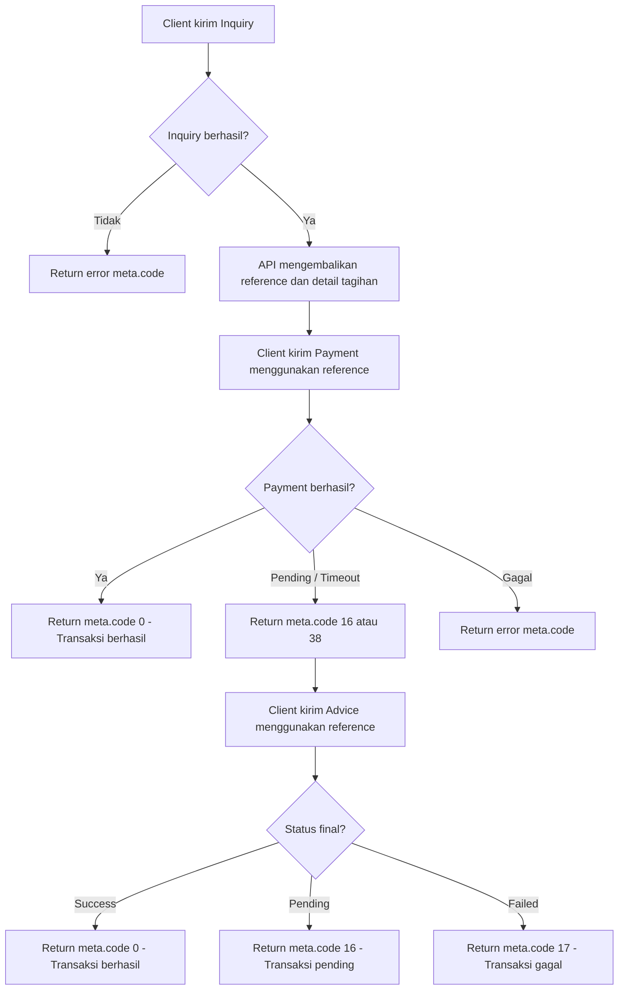

# Transaction API Documentation

## Inquiry

Proses untuk mengecek data pelanggan/tagihan sebelum pembayaran dilakukan. Inquiry menghasilkan `reference` yang akan digunakan pada proses payment dan advice.

## Payment

Proses pembayaran berdasarkan hasil inquiry yang sudah valid. Payment menggunakan `reference` dari inquiry untuk memproses transaksi.

## Advice

Proses pengecekan ulang status transaksi, biasanya digunakan ketika payment timeout, pending, atau response belum jelas.

## X-Device-Id

Header wajib untuk mengidentifikasi device yang melakukan request. Untuk endpoint authenticated, nilainya harus sesuai dengan `deviceId` pada token.

## Token Validation

Sistem memvalidasi token dari header `Authorization: Bearer {{access_token}}`. Token harus valid, belum expired, dan sesuai dengan `X-Device-Id`.

## Required Headers

| Header | Required | Description |
| --- | ---: | --- |
| `Authorization` | Yes | Bearer access token untuk autentikasi request |
| `X-Device-Id` | Yes | Device ID yang digunakan dan harus sesuai dengan token |

## Transaction Flow



## Transaction Flow Summary

1. Client melakukan inquiry.
2. Jika inquiry berhasil, API mengembalikan `reference` dan detail tagihan.
3. Client melakukan payment menggunakan `reference` dari inquiry.
4. Jika payment berhasil, transaksi selesai.
5. Jika payment pending atau timeout, client melakukan advice menggunakan `reference`.
6. Advice mengembalikan status transaksi: berhasil, gagal, atau masih pending.

## meta.code

`meta.code` adalah kode response dari API yang menunjukkan hasil request atau status transaksi.

| meta.code | Deskripsi |
| ---: | --- |
| `0` | Transaksi berhasil |
| `12` | Saldo tidak mencukupi |
| `16` | Transaksi pending |
| `17` | Transaksi gagal |
| `31` | Data inquiry tidak ditemukan |
| `37` | Sistem pembayaran sedang bermasalah |
| `38` | Sistem pembayaran tidak merespons / timeout |
| `39` | Sistem pembayaran tidak tersedia |
| `50` | Client reference sudah digunakan |
| `51` | Client reference sedang diproses |
| `52` | Payment sudah terjadi, lakukan advice |
| `53` | Transaksi melebihi limit |
| `54` | ID pelanggan tidak ditemukan atau tagihan sudah dibayar |
| `55` | ID pelanggan tidak valid |
| `56` | Tagihan sudah dibayar |
| `70` | Produk sedang cut off |
| `72` | Produk sedang maintenance |
| `401` | Token tidak valid atau expired |
| `403` | Akses ditolak atau device tidak sesuai |

## Example Headers

```http
Authorization: Bearer {{access_token}}
X-Device-Id: {{device_id}}
```

## Example Success Response

```json
{
  "meta": {
    "status": true,
    "code": 0,
    "errors": null
  },
  "data": {
    "reference": "CORE-REF-001"
  }
}
```

## Example Pending Response

```json
{
  "meta": {
    "status": true,
    "code": 16,
    "errors": {
      "message": [
        "Transaksi pending"
      ]
    }
  },
  "data": {
    "reference": "CORE-REF-001"
  }
}
```

## Example Error Response

```json
{
  "meta": {
    "status": false,
    "code": 55,
    "errors": {
      "message": [
        "ID pelanggan tidak valid"
      ]
    }
  },
  "data": null
}
```
