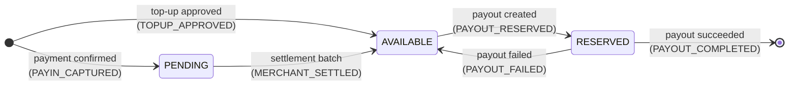
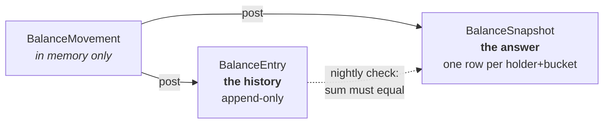
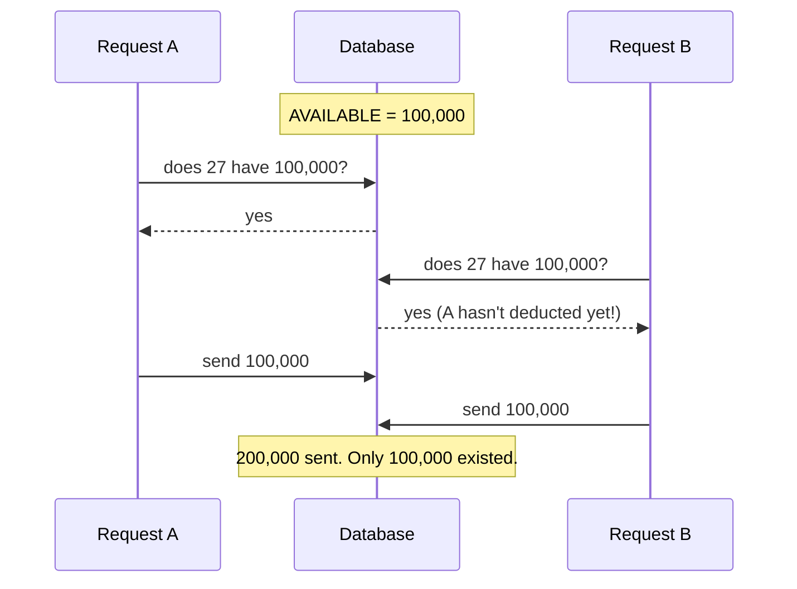

# Balance, Explained

No accounting background assumed. This is the "what is actually going on"
document for `libs/balance` and the two tables it writes.

The design docs next to this one say *why* things were chosen.
[settlement-batching.md](settlement-batching.md) is the shape,
[settlement-batching-implementation.md](settlement-batching-implementation.md)
is the build order. This one is for building the mental picture, and §9 is for
checking the code yourself without taking anyone's word for it.

---

## 1. First: debit and credit mean nothing clever here

The reason these words are confusing is that in real accounting they **flip
meaning** depending on what kind of account you are looking at. Debit increases
an asset but decreases a liability. That rule is genuinely hard to hold in your
head, and it trips up almost everyone.

**We do not do that.** This system has no asset accounts, no liability accounts,
no account types at all. So there is nothing to flip:

> ### `CREDIT` = the number goes **up**. `DEBIT` = the number goes **down**.
> Always. Every row. No exceptions.

That is the whole rule. You can check it in the code — it is one line in
`applyToSnapshot`:

```ts
const signed =
  leg.direction === BalanceDirectionEnum.CREDIT
    ? leg.amount          // add it
    : leg.amount.negated(); // subtract it
```

If you later talk to an accountant and they say "debit increases assets", they
are right about real bookkeeping and it does not apply to this codebase. We
borrowed two words, not the rules behind them.

### So why not just use `+` and `-`?

Because `amount` is a separate column that is **always positive**, and the
direction lives in its own column. That makes one category of bug impossible to
even write down: a "negative credit" is meaningless, but if amounts could be
negative, a bug could store one and it would still add up to something.

It also makes questions like *"how much has ever been credited to this
merchant?"* a plain query instead of a filtered sum over signs.

---

## 2. The three things

Everything in this system is built from three ideas.

### Who — the **holder**

Somebody whose money we are tracking.

| Holder type | Who | id |
|---|---|---|
| `MERCHANT` | a merchant | their merchant id |
| `AGENT` | an agent who earns a share of merchant transactions | their agent id |
| `INTERNAL` | us, the house | always `0` (`INTERNAL_HOLDER_ID`) |

### What state — the **bucket**

Money that belongs to a holder is always in exactly one of three states.

| Bucket | Plain meaning |
|---|---|
| `PENDING` | "This is yours, but you can't touch it yet." |
| `AVAILABLE` | "This is yours and you can spend it right now." |
| `RESERVED` | "This is yours but we've promised it to a payout that's in flight." |

A holder has a separate running total for each bucket. A merchant with
`PENDING = 50,000` and `AVAILABLE = 98,000` is owed 148,000 in total, but can
only spend 98,000 today.

### What happened — the **entry**

One row saying "this holder's bucket went up or down by this much, because of
this." Entries are **never edited and never deleted**. If something was wrong,
you add an opposite entry; you don't reach back and change history.

---

## 3. How money moves between buckets



Reading that diagram tells you almost everything:

- Money from a **payment** lands in `PENDING` first. It is not spendable yet,
  because the upstream has not settled it to us either.
- The **settlement batch** is the only thing that moves `PENDING → AVAILABLE`.
  That is its entire job.
- A **payout** does not take money straight out of `AVAILABLE`. It parks it in
  `RESERVED` first, *before* the provider is called. §7 explains why that
  matters more than it looks.
- `RESERVED` empties one of two ways: the payout worked and the money is gone,
  or it failed and the money comes back.

A **top-up** is the exception that proves the rule — the merchant hands us money
directly, so there is no upstream settlement to wait for and it goes straight to
`AVAILABLE`.

### Three reasons that are not on the diagram

The diagram is the *normal* life of money. Three more reasons exist for when
life is not normal, and they are deliberately not drawn because they do not
have a fixed shape:

| Reason | When | Shape |
|---|---|---|
| `PAYIN_REVERSED` | refund or chargeback | reverses a `PAYIN_CAPTURED` — out of whichever bucket the money reached |
| `MANUAL_ADJUSTMENT` | someone found a problem and an admin is correcting it | anything, by definition. Requires a written reason and an approver |
| `OPENING_BALANCE` | the one-off migration from the legacy tables | creates a starting balance out of nothing |

So the enum has **nine** reasons: six arrows above, plus these three.

---

## 4. Two tables, and why



**`BalanceEntry` is the history.** Every movement, forever. Slow to add up, but
it is the truth.

**`BalanceSnapshot` is the answer.** One row per holder per bucket, holding the
current number. Instant to read.

The analogy that works: `BalanceEntry` is a **receipt book** — every receipt you
have ever written, in order, never erased. `BalanceSnapshot` is the **total
written on the cover**. You trust the cover because you can always add up the
receipts and check.

### Why not just one table?

- **Only entries** → correct, but "what is merchant 27's balance?" means adding
  up every row they have ever had. Fine at a thousand rows, unusable at ten
  million.
- **Only a balance** → fast, but nothing can prove it. If it is wrong, it is
  wrong silently, forever, and you find out from an angry merchant.

This is also precisely what is wrong with the **old** `MerchantBalanceLog`: it
looks like a history, but each row *stores* the balance it resulted in, computed
from the row before it. So there is nothing to check it against. One wrong row
is inherited by every row after it and nothing notices.

**With two tables, the snapshot is a number you can prove.** That is the whole
point, and §9 is how you prove it.

---

## 5. A movement: several entries that belong together

Moving money from `PENDING` to `AVAILABLE` needs **two** entries — one taking it
out of `PENDING`, one putting it into `AVAILABLE`. Those two must happen
together or not at all. Half of that pair is money that vanished.

A `BalanceMovement` is that group:

```ts
{
  reason: 'MERCHANT_SETTLED',      // why
  sourceType: 'PURCHASE',          // what caused it
  sourceId: 123,                   // which one
  createdBy: 91,                   // who did it (a scheduler account)
  legs: [                          // the individual entries
    { MERCHANT 27, PENDING,   DEBIT,  98000 },
    { MERCHANT 27, AVAILABLE, CREDIT, 98000 },
  ],
}
```

It is never saved as a row of its own. It does not need to be — every entry it
creates carries the same `reason`, `sourceType` and `sourceId`, so "show me
everything that moved together" is just:

```sql
SELECT * FROM transaction."BalanceEntry"
WHERE "reason" = 'MERCHANT_SETTLED'
  AND "sourceType" = 'PURCHASE'
  AND "sourceId" = 123;
```

**`post()` is the only function that writes balance rows.** It takes a movement,
writes the entries, updates the snapshots. Nothing else in the codebase is
allowed to touch those two tables.

---

## 6. A full worked example

One QRIS payment of **100,000**, followed all the way through. Merchant 27, who
has agent 5 taking a share.

The fee split, calculated elsewhere:

| Who | Amount | Note |
|---|---|---|
| Provider (MotionPay) | 800 | they keep it — it never reaches us |
| Us (`INTERNAL`) | 1,000 | our cut |
| Agent 5 | 200 | their share |
| **Merchant 27** | **98,000** | what's left |

Note 800 + 1,000 + 200 + 98,000 = 100,000. ✓

### Start — nothing yet

Both tables are empty for these holders.

### Step 1 — the customer pays, the webhook arrives

`post()` is called with `PAYIN_CAPTURED`. Three legs — **the provider gets no
leg, because that 800 was never ours to track.**

`BalanceEntry` gains three rows:

| id | holder | bucket | dir | amount | reason | source |
|---|---|---|---|---|---|---|
| 1 | MERCHANT 27 | PENDING | CREDIT | 98,000.00 | PAYIN_CAPTURED | PURCHASE 123 |
| 2 | INTERNAL 0 | PENDING | CREDIT | 1,000.00 | PAYIN_CAPTURED | PURCHASE 123 |
| 3 | AGENT 5 | PENDING | CREDIT | 200.00 | PAYIN_CAPTURED | PURCHASE 123 |

`BalanceSnapshot` now:

| holder | bucket | amount |
|---|---|---|
| MERCHANT 27 | PENDING | 98,000.00 |
| INTERNAL 0 | PENDING | 1,000.00 |
| AGENT 5 | PENDING | 200.00 |

**Merchant 27 can spend nothing.** Their `AVAILABLE` row does not even exist
yet. That is correct — the upstream has not settled this money to us either.

### Step 2 — the settlement batch runs

Per the merchant's policy, this transaction is now eligible. The batch calls
`post()` with `MERCHANT_SETTLED` — **six** legs, a debit and a credit for each
of the three holders.

`BalanceEntry` gains six rows:

| id | holder | bucket | dir | amount | reason |
|---|---|---|---|---|---|
| 4 | MERCHANT 27 | PENDING | DEBIT | 98,000.00 | MERCHANT_SETTLED |
| 5 | MERCHANT 27 | AVAILABLE | CREDIT | 98,000.00 | MERCHANT_SETTLED |
| 6 | INTERNAL 0 | PENDING | DEBIT | 1,000.00 | MERCHANT_SETTLED |
| 7 | INTERNAL 0 | AVAILABLE | CREDIT | 1,000.00 | MERCHANT_SETTLED |
| 8 | AGENT 5 | PENDING | DEBIT | 200.00 | MERCHANT_SETTLED |
| 9 | AGENT 5 | AVAILABLE | CREDIT | 200.00 | MERCHANT_SETTLED |

`BalanceSnapshot`:

| holder | bucket | amount |
|---|---|---|
| MERCHANT 27 | PENDING | **0.00** |
| MERCHANT 27 | AVAILABLE | **98,000.00** |
| INTERNAL 0 | PENDING | 0.00 |
| INTERNAL 0 | AVAILABLE | 1,000.00 |
| AGENT 5 | PENDING | 0.00 |
| AGENT 5 | AVAILABLE | 200.00 |

Notice: **nothing was edited.** Rows 1–3 are still there, untouched. The
`PENDING` total reached zero because rows 4, 6 and 8 cancelled them out. The
history still shows exactly what happened and when.

This is also where the zero-sum check earns its place. For each holder, the
debit and the credit are equal, so that holder's *total* did not change — the
money only changed state. `validate()` refuses to post a `MERCHANT_SETTLED`
where they don't match, because that would mean money was invented or lost in
transit.

### Step 3 — the merchant requests a 30,000 payout

`reserve()` runs first. It asks the database one question:

> Is merchant 27's `AVAILABLE` at least 30,000 — and if so, lock that row so
> nobody else can spend it while I work?

98,000 ≥ 30,000, so yes. Then it posts `PAYOUT_RESERVED`:

| id | holder | bucket | dir | amount | reason |
|---|---|---|---|---|---|
| 10 | MERCHANT 27 | AVAILABLE | DEBIT | 30,000.00 | PAYOUT_RESERVED |
| 11 | MERCHANT 27 | RESERVED | CREDIT | 30,000.00 | PAYOUT_RESERVED |

| holder | bucket | amount |
|---|---|---|
| MERCHANT 27 | AVAILABLE | **68,000.00** |
| MERCHANT 27 | RESERVED | **30,000.00** |

**This happens before the provider is called.** The merchant's spendable balance
drops the instant the payout is created, not when it completes.

### Step 4a — the payout succeeds

| id | holder | bucket | dir | amount | reason |
|---|---|---|---|---|---|
| 12 | MERCHANT 27 | RESERVED | DEBIT | 30,000.00 | PAYOUT_COMPLETED |

| holder | bucket | amount |
|---|---|---|
| MERCHANT 27 | PENDING | 0.00 |
| MERCHANT 27 | AVAILABLE | 68,000.00 |
| MERCHANT 27 | RESERVED | **0.00** |

One entry, not two — the money genuinely left. It is not in another bucket, it
is gone to the recipient. This is why `PAYOUT_COMPLETED` is **not** in
`TRANSFER_REASONS`: its legs are *supposed* to change the holder's total.

### Step 4b — or, the payout fails

| id | holder | bucket | dir | amount | reason |
|---|---|---|---|---|---|
| 12 | MERCHANT 27 | RESERVED | DEBIT | 30,000.00 | PAYOUT_FAILED |
| 13 | MERCHANT 27 | AVAILABLE | CREDIT | 30,000.00 | PAYOUT_FAILED |

| holder | bucket | amount |
|---|---|---|
| MERCHANT 27 | AVAILABLE | **98,000.00** |
| MERCHANT 27 | RESERVED | 0.00 |

Back where it was. Two legs, netting to zero for the holder — a transfer, so the
zero-sum check applies.

---

## 7. Why `RESERVED` exists

This is the piece that looks like unnecessary complexity and is not. It fixes a
bug that is **live in the legacy code right now** (D17).

**Without `RESERVED`:**



Two requests arriving at the same instant both check, both see 100,000, both
pass, both send. The merchant withdrew money that was never there.

**With `RESERVED`,** the check and the deduction are the *same database
statement*, so there is no gap between them to slip through:

```sql
SELECT 1 FROM "BalanceSnapshot"
WHERE ... AND "bucket" = 'AVAILABLE' AND "amount" >= 30000
FOR UPDATE;
```

`FOR UPDATE` locks the row. The second request waits for the first to finish,
then re-checks against the *new* balance — and finds it no longer qualifies. It
gets `INSUFFICIENT_BALANCE` instead of sending money.

The general principle, worth remembering because it explains a lot of this
design:

> **A credit arriving late costs nothing. A debit arriving late is money already
> sent that was never deducted.**

That is why payins can be batched and payouts cannot.

---

## 8. What stops things going wrong

Five protections, in plain language.

| Protection | What it stops | How |
|---|---|---|
| **Entries are never edited** | History being rewritten to hide a mistake | No `UPDATE` or `DELETE` path exists in the code |
| **Amount is always positive** | A "negative credit" — a meaningless value that still sums | Direction is a separate column; `validate()` rejects ≤ 0 |
| **Unique constraint** | Double-crediting from a replayed webhook | One entry per `(holder, bucket, reason, sourceType, sourceId)`. A second insert fails |
| **`RESERVED` bucket** | Two payouts spending the same money | §7 |
| **Nightly check** | The snapshot quietly drifting from the truth | §9 — it re-adds the entries and compares |

That third one is worth a sentence more. Providers retry callbacks — it is
normal, not a fault. Without the unique constraint, a retried "payment
succeeded" callback would credit the merchant twice. With it, the second attempt
hits the constraint and fails loudly instead.

---

## 9. How to check any of this yourself

You do not have to trust the code. Every claim above is checkable with two
queries.

### Is a balance correct?

Add up the entries:

```sql
SELECT COALESCE(SUM(
  CASE WHEN "direction" = 'CREDIT' THEN "amount" ELSE -"amount" END
), 0) AS computed
FROM transaction."BalanceEntry"
WHERE "holderType" = 'MERCHANT'
  AND "holderId"   = 27
  AND "bucket"     = 'AVAILABLE';
```

Compare against what the snapshot claims:

```sql
SELECT "amount" AS stored
FROM transaction."BalanceSnapshot"
WHERE "holderType" = 'MERCHANT'
  AND "holderId"   = 27
  AND "bucket"     = 'AVAILABLE';
```

**These two numbers must always be equal.** If they are not, something is wrong
and it needs a person — never "fix" the snapshot, because the difference is
evidence of the actual bug.

This is exactly what the Step 4 nightly job automates.

### What happened to one transaction?

```sql
SELECT "id", "holderType", "holderId", "bucket", "direction", "amount", "reason"
FROM transaction."BalanceEntry"
WHERE "sourceType" = 'PURCHASE' AND "sourceId" = 123
ORDER BY "id";
```

That is the complete story of one payment. Compare it against §6 — it should
look exactly like those tables.

### Did a settlement batch balance?

Every `MERCHANT_SETTLED` movement should sum to zero per holder:

```sql
SELECT "holderType", "holderId",
       SUM(CASE WHEN "direction" = 'CREDIT' THEN "amount" ELSE -"amount" END) AS net
FROM transaction."BalanceEntry"
WHERE "reason" = 'MERCHANT_SETTLED'
GROUP BY "holderType", "holderId"
HAVING SUM(CASE WHEN "direction" = 'CREDIT' THEN "amount" ELSE -"amount" END) <> 0;
```

**This should return zero rows.** Any row is money that appeared or vanished
during settlement.

---

## 10. Reviewing this code without an accounting background

You do not need accounting to review this. You need to check that the code
matches the picture above. Concrete things to look for:

**1. Does anything write to these tables except `post()`?**

```bash
grep -rn "balanceEntry\.\|balanceSnapshot\." --include="*.ts" apps/ libs/ | grep -v generated
```

Everything outside `libs/balance/src/balance.service.ts` is a finding.

**2. Does anything update or delete an entry?**

```bash
grep -rn "balanceEntry\.\(update\|delete\|upsert\)" --include="*.ts" apps/ libs/ | grep -v generated
```

Should return nothing, ever.

**3. Does every reason in the code match §3?** Open `balance.enum.ts` and read
`BalanceReasonEnum`. There should be exactly nine: six that are arrows on the
diagram, and the three exceptional ones listed under it. A tenth reason that is
neither means the code has grown a concept the documentation does not know
about — worth asking about before it spreads.

**4. Is `post()` always called inside a transaction?** Look for
`prisma.$transaction(` wrapping every call site. If a call is not inside one,
the entries and the snapshot can commit separately — which is the one failure
this whole design exists to prevent. (`post()` throws if handed a root client,
so this is belt-and-braces.)

**5. Does anything pass a negative amount?** `validate()` rejects it, but a
call site trying to is a sign someone has the model wrong — direction carries
the sign, never the amount.

**6. Run the §9 queries against real data after any change.** This is the
strongest check available and it needs no code reading at all.

---

## 11. Vocabulary

| Term | Meaning here |
|---|---|
| **Holder** | Whose money: a merchant, an agent, or us |
| **Bucket** | What state it's in: `PENDING`, `AVAILABLE`, `RESERVED` |
| **Entry** | One row: this holder's bucket went up or down by this much |
| **Movement** | A group of entries that must happen together |
| **Leg** | One entry inside a movement |
| **Credit** | The number goes up |
| **Debit** | The number goes down |
| **Snapshot** | The current total for one holder + bucket |
| **Reason** | Why a movement happened — `PAYIN_CAPTURED`, `MERCHANT_SETTLED`, … |
| **Source** | What caused it — a purchase, a payout, an adjustment |
| **Post** | To write a movement into the tables |
| **Reserve** | To move money to `RESERVED` for an in-flight payout |
| **Transfer reason** | A reason whose legs must net to zero per holder |
| **Idempotent** | Doing it twice has the same effect as doing it once |
